# System Serial Bus Design

---

## Overview

The Serial Bus System is a compact, resource-efficient serial bus designed for FPGA platforms. The implementation targets the Intel Cyclone IV family on the Terasic DE0-Nano board and demonstrates a multi-master multi-slave serial interconnect supporting split transactions and a UART-based bus bridge for inter-bus communication.

The system uses a 1-bit serial data path and an explicit request/grant arbitration scheme with split-transaction support to allow long-latency peripherals to relinquish the bus while the rest of the system continues operation.

### Key Features
*   **Multi-Master Support:** Two masters with deterministic priority arbitration (M1 prioritized). Master 2 serves as the interface for remote commands via UART.
*   **Split Transactions:** Slaves that cannot respond immediately (like the Bridge Slave) can assert a `ssplit` line. The arbiter tracks the split owner and issues a `split_grant` when the slave becomes ready, allowing other masters to use the bus in the interim.
*   **Bus Bridge:** UART-based bridge supports translation between local serial bus frames and remote bus frames; uses FIFOs to cross clock domains.
*   **Resource Efficiency:** Single-bit serial data and compact FSMs reduce LUT/logic usage and routing complexity.

---

## Architecture

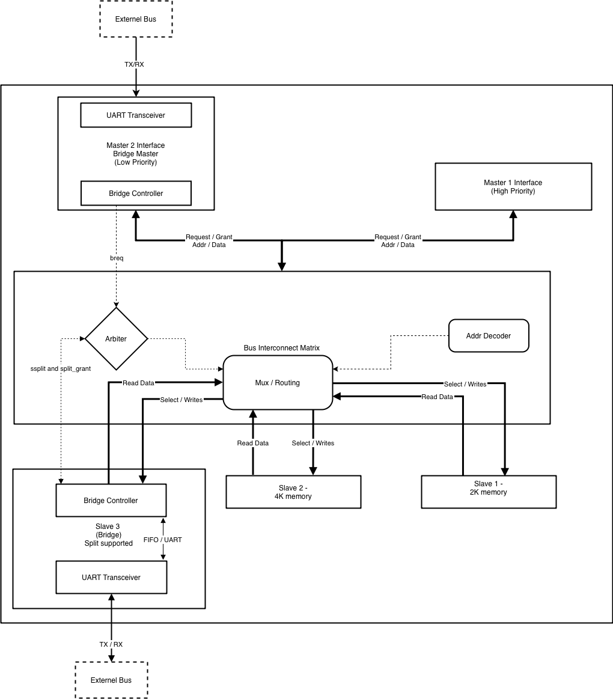
*Figure 1: Full System Architecture*

The design includes:
1.  **Two Masters**: Master 1 (High priority) and Master 2 (Bridge Master).
2.  **Three Slaves**: Slave 1 (2KB), Slave 2 (4KB), and Slave 3 (4KB Bridge Slave).
3.  **Bus Interconnect**: Arbiter, Address Decoder, and Muxes.

---

## Address Allocation

A 16-bit address format is used. The upper bits select the device (Slave), and the lower bits address the memory within that slave.

**Local Address Map:**

| Device ID | Slave | Size | Address Range | Notes |
| :--- | :--- | :--- | :--- | :--- |
| **0000** | Slave 1 | 2 KB | `0x0000` -- `0x07FF` | Local BRAM |
| **0001** | Slave 2 | 4 KB | `0x1000` -- `0x1FFF` | Local BRAM |
| **0010** | Slave 3 | 4 KB | `0x2000` -- `0x2FFF` | Bridge/Split Supported |

---

## Module Descriptions

### 1. Master Port

The Master Port interfaces a master device to the serial bus. It serializes addresses and data, handles bus requests, and manages the split/resume handshake.

**Block Diagram**
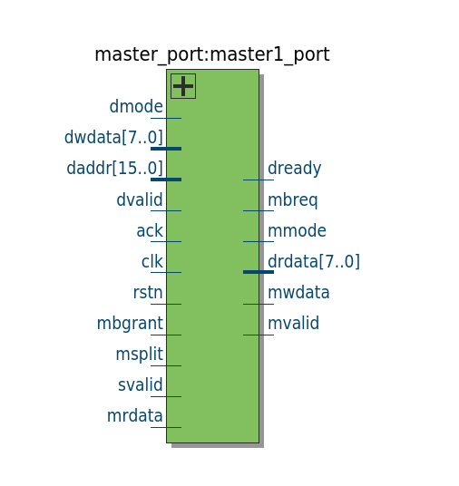

**I/O Signals**

| Signal | Dir | Description |
| :--- | :--- | :--- |
| `daddr[15:0]` | Input | 16-bit address from master device |
| `dwdata[7:0]` | Input | 8-bit write data from master device |
| `drdata[7:0]` | Output | 8-bit read data returned to master device |
| `dvalid` | Input | Master asserts to request a transaction |
| `dready` | Output | Port ready for new transaction (IDLE) |
| `dmode` | Input | 0=Read, 1=Write |
| `mwdata` | Output | Serial bit stream to bus (address/data) |
| `mrdata` | Input | Serial bit received from a slave |
| `mvalid` | Output | Serial valid signal pointing to bus |
| `mbreq` | Output | Bus request line to arbiter |
| `mbgrant` | Input | Bus grant from arbiter |
| `msplit` | Input | Indicates current transaction is split |

**State Machine**
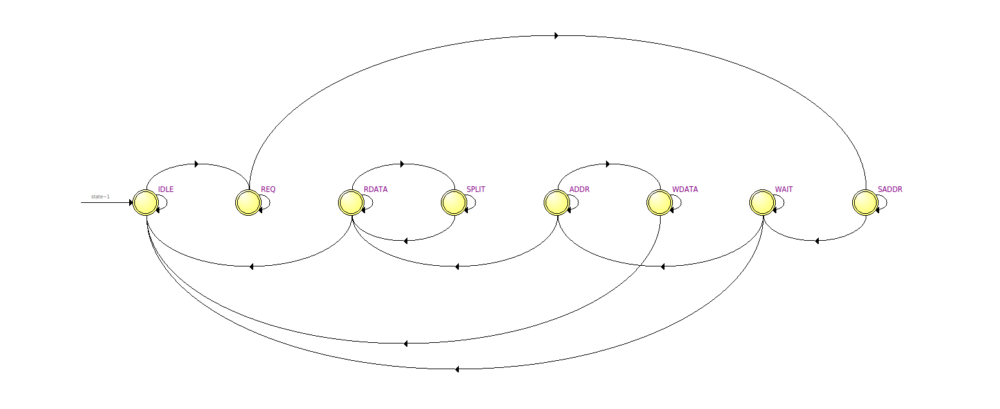

*   **IDLE**: Wait for request.
*   **REQ**: Request bus access (`mbreq`).
*   **SADDR**: Send 4-bit Device Address.
*   **WAIT**: Wait for Address Decoder ACK.
*   **ADDR**: Send 12-bit Memory Address.
*   **WDATA/RDATA**: Transmit or Receive data bits.
*   **SPLIT**: Release bus if slave signals split, wait for re-grant.

### 2. Slave Port

The Slave Port deserializes address/data, controls local memory, and serializes read data.

**Block Diagram**

**I/O Signals**

| Signal | Dir | Description |
| :--- | :--- | :--- |
| `swdata` | Input | Serial stream from active master |
| `srdata` | Output | Serial read data to master |
| `mvalid` | Input | Valid signal from master |
| `sready` | Output | Slave ready status |
| `ssplit` | Output | Slave split request |
| `split_grant` | Input | Resume signal from Arbiter |
| `smem*` | In/Out | Interface to local BRAM |

**State Machine**
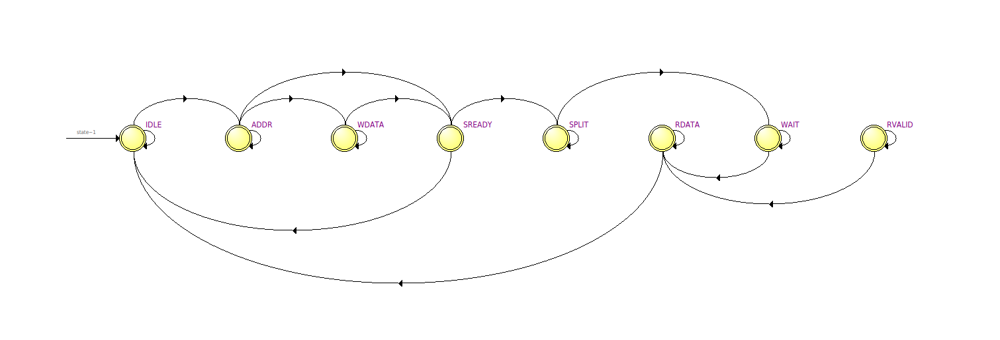

*   **ADDR**: Deserialize address.
*   **SREADY**: Assert ready to local memory.
*   **WDATA**: Deserialize write data.
*   **RDATA**: Serialize read data.
*   **SPLIT**: Signal split request (used by Bridge Slave).

### 3. Arbiter

Priority-based arbiter (Master 1 > Master 2) that also manages split transaction ownership.

**Block Diagram**
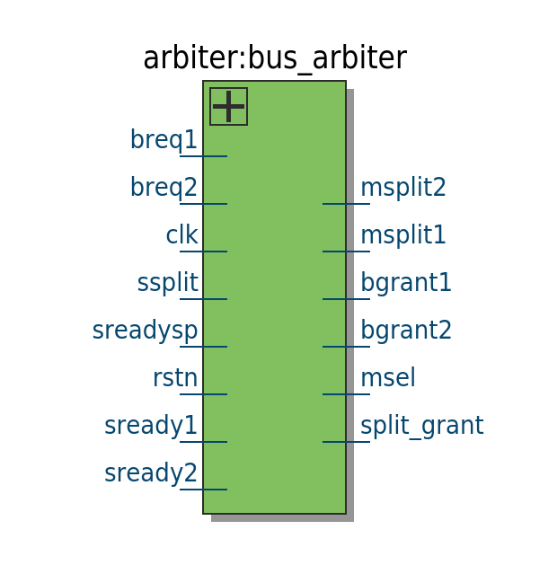

**I/O Signals**

| Signal | Dir | Description |
| :--- | :--- | :--- |
| `breq1/2` | Input | Requests from Masters |
| `bgrant1/2` | Output | Grants to Masters |
| `ssplit` | Input | Split request from Slave 3 |
| `split_grant` | Output | Notifications to masters/slaves to resume |

**State Machine**
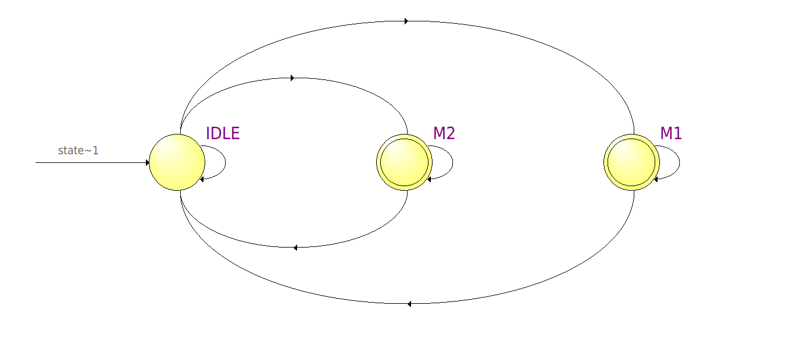

*   Checks requests in **IDLE**.
*   Grants **M1** or **M2**.
*   If `ssplit` occurs, remembers "Split Owner" and allows other masters to use the bus until `split_grant` is issued.

### 4. Address Decoder

Decodes the 4-bit Device ID during the initial transaction phase.

**Block Diagram**
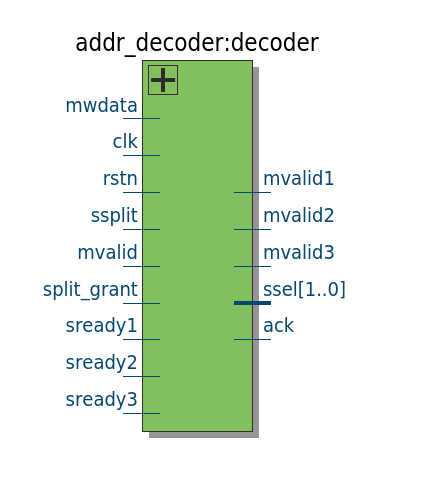

**I/O Signals**

| Signal | Dir | Description |
| :--- | :--- | :--- |
| `mwdata` | Input | Serial stream (for address) |
| `ack` | Output | Acknowledge to Master |
| `ssel[1:0]` | Output | Slave Select |
| `mvalid*` | Output | Routed valid signals |

**State Machine**
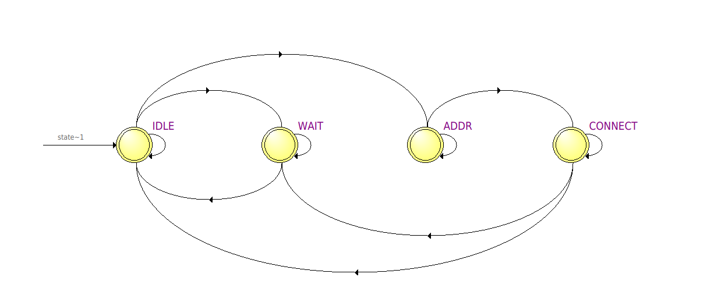

*   **ADDR**: Receives device ID.
*   **CONNECT**: Checks validity and slave readiness; asserts ACK.

### 5. Bus Bridge Master

Interfaces the local serial bus with a remote system via UART.

**Block Diagram**
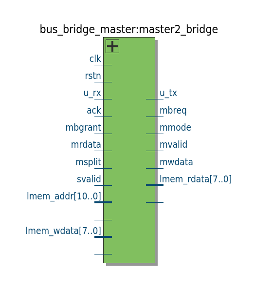

**I/O Signals**

| Signal | Dir | Description |
| :--- | :--- | :--- |
| `u_rx` | Input | UART Receive (Commands) |
| `u_tx` | Output | UART Transmit (Responses) |
| `mbreq` | Output | Bus Request |
| `lmem_*` | In/Out | Local BRAM Access |

**Operation Logic**:
1.  **Command Input**: UART bytes are buffered in a FIFO.
2.  **Bus Transaction**: Controller initiates Master Port request when FIFO has data.
3.  **Response**: Read data is sent back via UART.

### 6. Bus Bridge Slave

Forwards local bus requests to a remote system via UART using Split Transactions.

**Block Diagram**
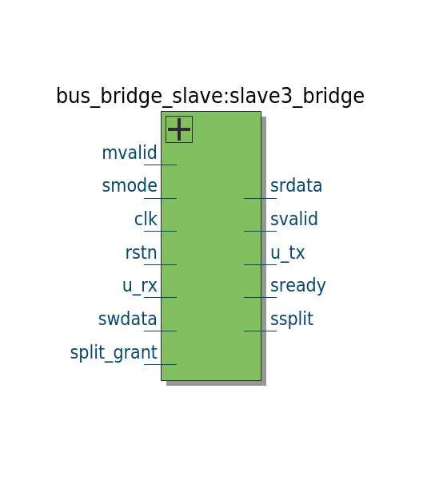

**I/O Signals**

| Signal | Dir | Description |
| :--- | :--- | :--- |
| `swdata` | Input | Data from master |
| `srdata` | Output | Data to master |
| `ssplit` | Output | Asserted during UART latency |
| `u_tx/rx` | Out/In | UART Bridge Interface |

**State Machine**
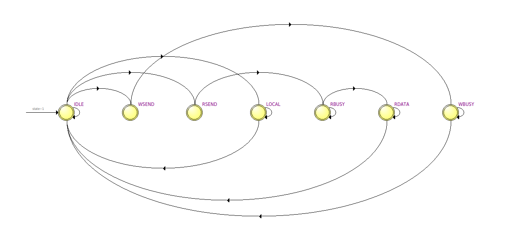

*   **WSEND/RSEND**: Start UART transmission.
*   **RDATA**: Wait for UART response (Bus held in SPLIT).

### 7. UART Module

Standard 8N1 UART for physical layer communication.

**Block Diagram**
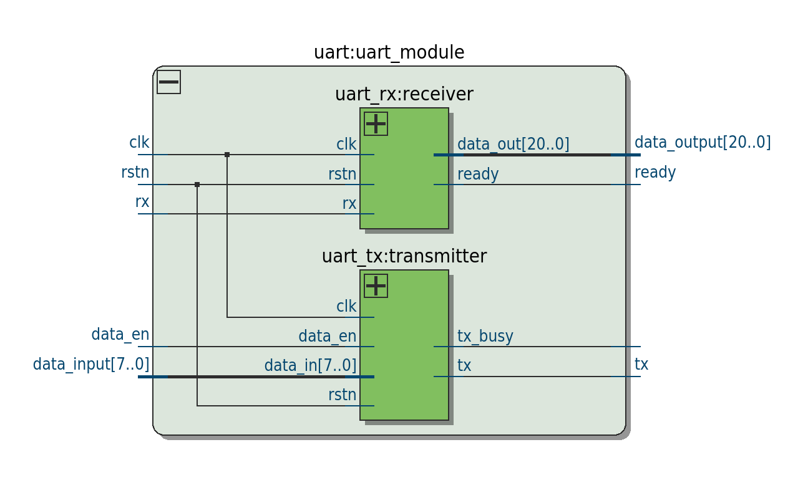

**I/O Signals**

| Signal | Dir | Description |
| :--- | :--- | :--- |
| `tx`, `rx` | Out/In | Serial Physical Lines |
| `data_input/output` | In/Out | Parallel Data |
| `ready`, `data_en` | Out/In | Control Signals |

---

## Bus Interconnect

The top-level interconnect (`bus_m2_s3.v`) wires the Arbiter, Decoder, and Muxes.

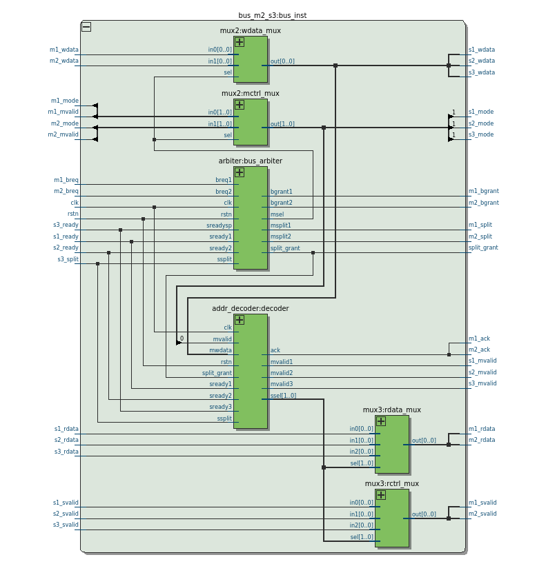

**Top Level I/O**

| Signal | Dir | Description |
| :--- | :--- | :--- |
| `m1_rdata` | Output | Read data to Master 1 |
| `m1_wdata` | Input | Write data/addr from Master 1 |
| `m1_mbreq` | Input | Request from Master 1 |
| `m1_mbgrant` | Output | Grant to Master 1 |
| `s1_wdata` | Output | Write data to Slave 1 | 
| `s1_rdata` | Input | Read data from Slave 1 |

---

## Simulation Results

The system was verified using ModelSim/Questasim with the `master2_slave3_tb.sv` testbench.

*   **Iterations:** 20 Loops
*   **Scenarios:** Write, Read, Simultaneous Access, Split Transactions, Conflicts.
*   **Result:** **ALL PASS** (60/60 Transactions verified).

Key behaviors confirmed:
1.  **Arbitration:** M1 correctly preempts M2.
2.  **Splits:** Bus released and re-granted correctly for Bridge Slave.
3.  **Data Integrity:** All byte transfers matched.

---

## Resource Utilization

**Target:** Cyclone IV EP4CE22F17C6 (DE0-Nano)

| Resource Type | Usage | Percentage |
| :--- | :--- | :--- |
| Total Logic Elements | 1,551 | 7% |
| Total Registers | 1,077 | - |
| Total Memory Bits | 65,536 | 11% |
| Total Pins | 19 | 12% |

**Timing:**
*   **FMax:** ~173 MHz (Setup slack > 14ns at 50MHz).

---